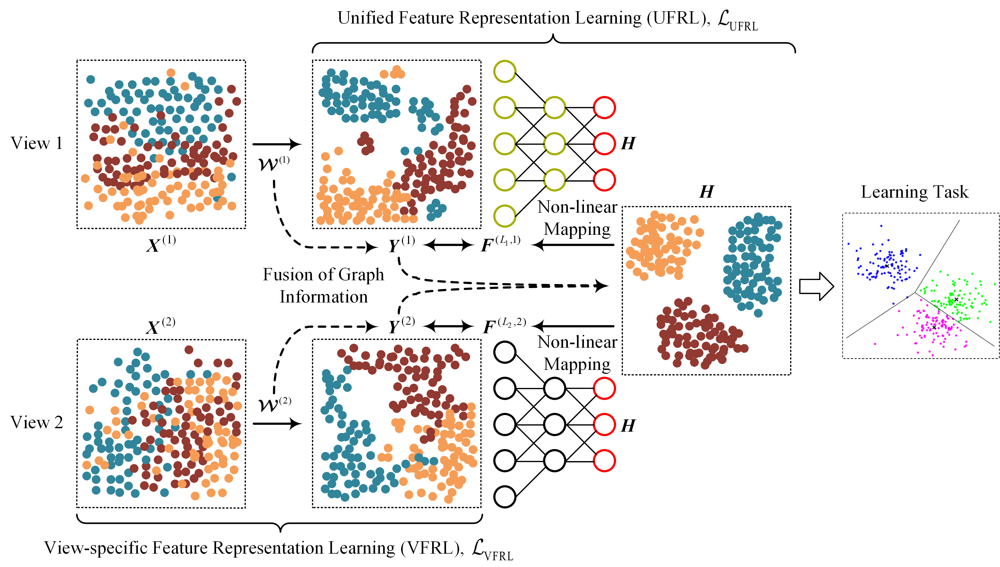

# GUMRL
Source codes of Graph-guided Unsupervised Multi-view Representation Learning pubilished in IEEE TCSVT 2022

If you find the codes useful in your research, please cite our work as follows, thanks.

@article\{GUMRL, 
      &nbsp;&nbsp;&nbsp;&nbsp;title=\{Graph-guided Unsupervised Multi-view Representation Learning\}, 
      &nbsp;&nbsp;&nbsp;&nbsp;author=\{Zheng, Qinghai and Zhu, Jihua and Li, Zhongyu and Tang, Haoyu\}, 
      &nbsp;&nbsp;&nbsp;&nbsp;journal=\{IEEE Transactions on Circuits and Systems for Video Technology\}, 
      &nbsp;&nbsp;&nbsp;&nbsp;year=\{2022\}, 
      &nbsp;&nbsp;&nbsp;&nbsp;doi=\{10.1109/TCSVT.2022.3200451\} 
\} 

Email: qhxjtu@163.com
